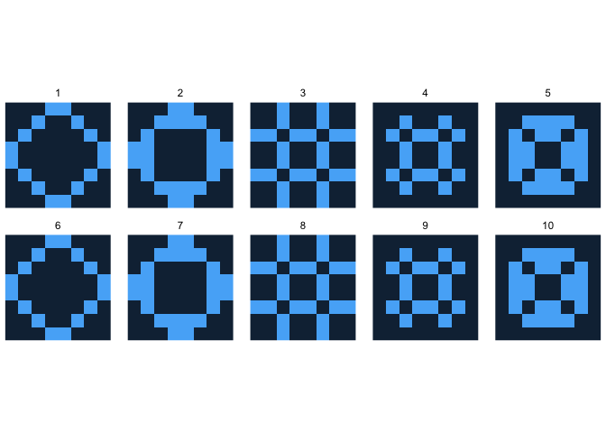

# lifegamer


Lifegame implementation in R without `if`-expressions and `for`-loops.

## Examples

### 10-pixels segment

``` r
animate(lifegame(first_generation_segment10(), 25), ncol = 5)
```


### Octagon

``` r
animate(lifegame(first_generation_octagon(), 10), ncol = 5)
```


